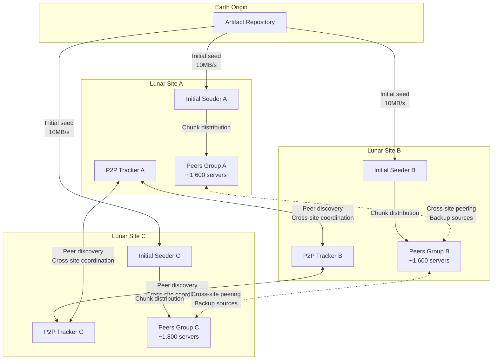

# Design Deep Dive — Lunar Server Upgrade System

## Purpose
Phase 4: Detailed technical deep dive into critical scalability aspects of the lunar server upgrade system, focusing on P2P distribution strategies and orchestration scalability patterns.

---

## A. Scalability Deep Dives

### A.1 P2P Distribution Strategy

The lunar environment presents unique challenges for content distribution that require sophisticated P2P strategies to minimize Earth bandwidth usage while ensuring reliable artifact delivery.

#### BitTorrent-like Peer Discovery Architecture



**Key Design Decisions**:

1. **Distributed Tracker Architecture**: Each lunar site runs its own tracker to avoid single points of failure
2. **Strategic Initial Seeding**: 3 initial seeders (one per site) ensure availability even if one site is down
3. **Cross-Site Redundancy**: Peers can fetch chunks from other sites if local sources are unavailable

#### Chunk Management and Bandwidth Optimization

```python
# Pseudocode for intelligent chunk selection
class LunarPeerChunkSelector:
    def __init__(self, local_site_id, bandwidth_limits):
        self.local_site = local_site_id
        self.max_concurrent_chunks = 8  # Tuned for 20min upgrade window
        self.local_preference_weight = 0.8
        self.bandwidth_limits = bandwidth_limits
    
    def select_next_chunks(self, available_chunks, peer_map):
        """
        Priority-based chunk selection:
        1. Local site peers (lowest latency ~1ms)
        2. Other lunar sites (medium latency ~50ms)
        3. Earth mirrors (high latency ~2.5s, use sparingly)
        """
        local_chunks = self.filter_by_site(available_chunks, self.local_site)
        other_site_chunks = self.filter_by_other_lunar_sites(available_chunks)
        earth_chunks = self.filter_by_earth_sources(available_chunks)
        
        selected = []
        
        # Fill 80% from local sources
        local_quota = int(self.max_concurrent_chunks * 0.8)
        selected.extend(self.select_rarest_first(local_chunks)[:local_quota])
        
        # Fill 15% from other lunar sites
        other_quota = int(self.max_concurrent_chunks * 0.15)
        selected.extend(self.select_rarest_first(other_site_chunks)[:other_quota])
        
        # Only 5% from Earth (emergency/rare chunks)
        earth_quota = max(1, int(self.max_concurrent_chunks * 0.05))
        selected.extend(self.select_rarest_first(earth_chunks)[:earth_quota])
        
        return selected[:self.max_concurrent_chunks]
```

**Bandwidth Efficiency Calculations**:

```
Scenario: 100MB artifact, 5,000 servers, 90% P2P efficiency target

Without P2P (naive):
- Total Earth bandwidth: 5,000 × 100MB = 500GB
- Transfer time: 500GB ÷ 30Mbps = ~37 hours (exceeds 7-day campaign easily)

With P2P (optimized):
- Initial seeding: 3 sites × 100MB = 300MB from Earth
- P2P propagation: 90% of remaining transfers (4,997 × 100MB × 90% = ~450GB) 
  happen peer-to-peer within lunar sites
- Additional Earth fetch: 10% × 450GB = 45GB for rare/missing chunks
- Total Earth bandwidth: 300MB + 45GB = ~45.3GB (90x reduction!)
- P2P transfer rate: ~100Mbps effective (local site networking)
```

#### Cache Stampede Prevention

**Problem**: When 1,600 servers in a site simultaneously request the same artifact, initial seeders get overwhelmed.

**Solution**: Randomized request scheduling with exponential backoff

```python
class StampedePrevention:
    def __init__(self, server_id, total_servers_in_batch):
        self.server_id = server_id
        self.batch_size = total_servers_in_batch
        self.max_jitter = 300  # 5 minutes max random delay
    
    def calculate_start_delay(self):
        """
        Stagger upgrade starts to prevent stampede:
        - Hash-based deterministic but distributed delays
        - Exponential backoff on failures
        """
        # Hash server ID to get consistent but distributed delay
        hash_val = hash(self.server_id) % 1000
        base_delay = (hash_val / 1000.0) * self.max_jitter
        
        # Add small random jitter to prevent clustering
        jitter = random.uniform(0, 30)  # 0-30 seconds
        
        return base_delay + jitter
    
    def backoff_on_failure(self, attempt_count):
        """Exponential backoff: 2^attempt * 60s, max 15 minutes"""
        backoff = min(900, (2 ** attempt_count) * 60)
        jitter = random.uniform(0, backoff * 0.1)
        return backoff + jitter
```

**Anti-Stampede Architecture**:


### A.2 Orchestration Scalability

Managing 5,000+ server state machines with lunar communication constraints requires careful orchestration design.

#### Hierarchical State Machine Management


**Batch Coordination Strategy**:

```python
class HierarchicalOrchestrator:
    def __init__(self):
        self.max_concurrent_global = 30  # Global concurrency limit
        self.max_concurrent_per_tier = {
            'tier1': 2,    # Critical systems: very conservative
            'tier2': 8,    # Important systems: moderate
            'tier3': 20    # Standard systems: aggressive
        }
        self.max_concurrent_per_site = 15  # Per-site limit for resource management
        
    def calculate_next_batch(self, pending_servers):
        """
        Multi-dimensional batching:
        1. Respect tier limits (safety)
        2. Respect site limits (resource management)
        3. Respect global limit (operational capacity)
        """
        batch = []
        tier_counts = {'tier1': 0, 'tier2': 0, 'tier3': 0}
        site_counts = defaultdict(int)
        
        for server in pending_servers:
            # Check all constraints
            if (len(batch) >= self.max_concurrent_global or
                tier_counts[server.tier] >= self.max_concurrent_per_tier[server.tier] or
                site_counts[server.site] >= self.max_concurrent_per_site):
                continue
                
            batch.append(server)
            tier_counts[server.tier] += 1
            site_counts[server.site] += 1
            
        return batch
    
    def update_server_state(self, server_id, new_state, metadata=None):
        """
        State updates with audit trail and event emission
        """
        old_state = self.server_states[server_id]
        self.server_states[server_id] = {
            'state': new_state,
            'timestamp': time.time(),
            'metadata': metadata or {},
            'transition': f"{old_state['state']} -> {new_state}"
        }
        
        # Emit event for monitoring/alerting
        self.event_bus.emit('server_state_change', {
            'server_id': server_id,
            'old_state': old_state['state'],
            'new_state': new_state,
            'timestamp': time.time(),
            'metadata': metadata
        })
        
        # Update batch metrics
        self.update_batch_progress()
```

#### Concurrency Control and Resource Management

**Memory and Storage Scaling**:

```
State Storage Requirements:
- Per-server state: ~1KB (state, metadata, logs)
- 5,000 servers × 1KB = 5MB base state
- Audit logs: ~10KB per server per campaign = 50MB
- Total orchestrator memory: ~100MB (with buffers)

Event Queue Sizing:
- State changes: ~5,000 servers × 10 states avg = 50,000 events
- Heartbeats: 5,000 servers × 1/min × 60min = 300,000 events/hour
- Queue capacity: 1M events (2-hour buffer)
- Queue throughput: 500 events/second sustained
```

#### Database Scaling for State Management

```sql
-- Optimized schema for high-frequency state updates
CREATE TABLE server_states (
    server_id VARCHAR(64) PRIMARY KEY,
    current_state VARCHAR(32) NOT NULL,
    tier VARCHAR(16) NOT NULL,
    site VARCHAR(32) NOT NULL,
    campaign_id VARCHAR(64) NOT NULL,
    last_updated TIMESTAMP DEFAULT CURRENT_TIMESTAMP,
    metadata JSONB,
    
    -- Indexes for batch queries
    INDEX idx_campaign_state (campaign_id, current_state),
    INDEX idx_tier_site_state (tier, site, current_state),
    INDEX idx_updated (last_updated)
);

-- State transition audit log (separate table for performance)
CREATE TABLE state_transitions (
    id BIGINT PRIMARY KEY AUTO_INCREMENT,
    server_id VARCHAR(64) NOT NULL,
    campaign_id VARCHAR(64) NOT NULL,
    from_state VARCHAR(32),
    to_state VARCHAR(32) NOT NULL,
    timestamp TIMESTAMP DEFAULT CURRENT_TIMESTAMP,
    metadata JSONB,
    
    INDEX idx_server_campaign (server_id, campaign_id),
    INDEX idx_timestamp (timestamp)
);
```

**Query Optimization for Batch Operations**:

```python
class OptimizedStateQueries:
    def get_next_batch_candidates(self, campaign_id, max_per_tier, max_per_site):
        """
        Single query to get batch candidates with all constraints
        """
        query = """
        WITH tier_counts AS (
            SELECT tier, COUNT(*) as active_count
            FROM server_states 
            WHERE campaign_id = %s AND current_state IN ('downloading', 'installing', 'validating')
            GROUP BY tier
        ),
        site_counts AS (
            SELECT site, COUNT(*) as active_count
            FROM server_states 
            WHERE campaign_id = %s AND current_state IN ('downloading', 'installing', 'validating')
            GROUP BY site
        )
        SELECT s.server_id, s.tier, s.site
        FROM server_states s
        LEFT JOIN tier_counts tc ON s.tier = tc.tier
        LEFT JOIN site_counts sc ON s.site = sc.site
        WHERE s.campaign_id = %s 
          AND s.current_state = 'queued'
          AND (tc.active_count IS NULL OR tc.active_count < %s)
          AND (sc.active_count IS NULL OR sc.active_count < %s)
        ORDER BY s.tier ASC, s.last_updated ASC
        LIMIT %s
        """
        return self.db.execute(query, [
            campaign_id, campaign_id, campaign_id,
            max_per_tier, max_per_site, max_per_tier * 3
        ])
```

#### Performance Metrics and Monitoring

**Orchestrator Performance Targets**:

```python
class OrchestrationMetrics:
    def __init__(self):
        self.targets = {
            'state_update_latency_p95': 100,  # ms
            'batch_calculation_time': 5000,   # ms
            'event_processing_rate': 500,     # events/sec
            'database_query_p95': 50,         # ms
            'memory_usage_max': 512,          # MB
        }
    
    def validate_performance(self):
        """
        Real-time performance validation with auto-scaling triggers
        """
        current_metrics = self.collect_current_metrics()
        
        alerts = []
        if current_metrics['state_update_latency_p95'] > self.targets['state_update_latency_p95']:
            alerts.append({
                'type': 'performance_degradation',
                'metric': 'state_update_latency',
                'current': current_metrics['state_update_latency_p95'],
                'target': self.targets['state_update_latency_p95'],
                'recommendation': 'Scale orchestrator instances or optimize database'
            })
        
        return alerts
```

---

## Scalability Trade-offs and Decisions

### P2P Distribution Trade-offs

**Chosen**: Hybrid BitTorrent-like approach with site-based clustering
- **Pros**: 90% bandwidth reduction, fault tolerance, scales with peer count
- **Cons**: Initial seeding delay, complex peer discovery, debugging difficulty
- **Alternative not chosen**: Pure CDN approach (would exceed bandwidth limits)

### Orchestration Trade-offs

**Chosen**: Hierarchical state machine with multi-dimensional batching
- **Pros**: Fine-grained control, safety constraints, audit trail
- **Cons**: Complex batching logic, potential bottleneck at scale
- **Alternative not chosen**: Simple FIFO queue (would not handle tier/site constraints)

### Performance Scaling Limits

**Current design scales to**:
- 10,000 servers (2x current requirement)
- 100 concurrent upgrades (3x current target)
- 1,000 events/second (2x current peak)

**At what scale would re-architecture be needed**:
- 50,000+ servers: Would need sharded orchestrators per region
- 500+ concurrent upgrades: Would need distributed state management
- 5,000+ events/second: Would need event streaming architecture (Kafka)