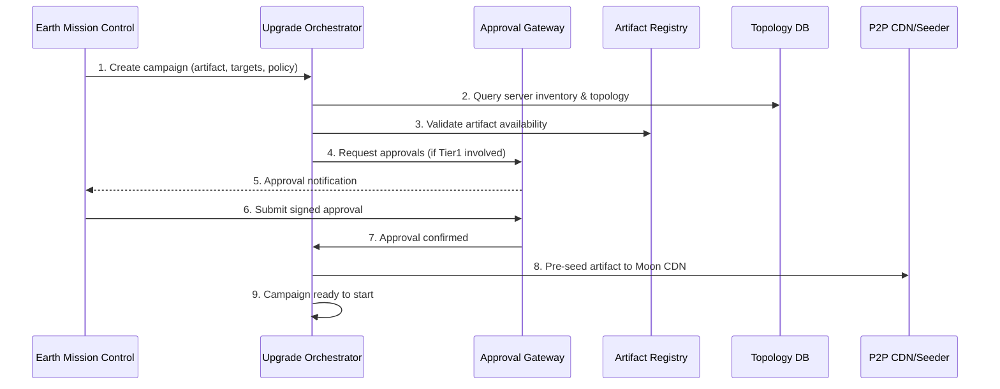
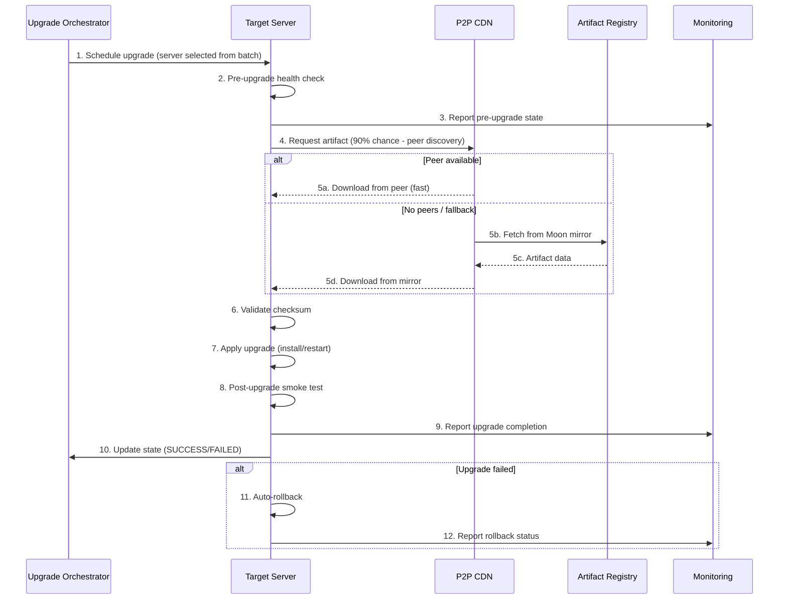
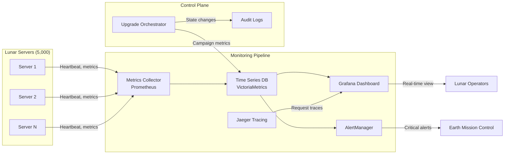
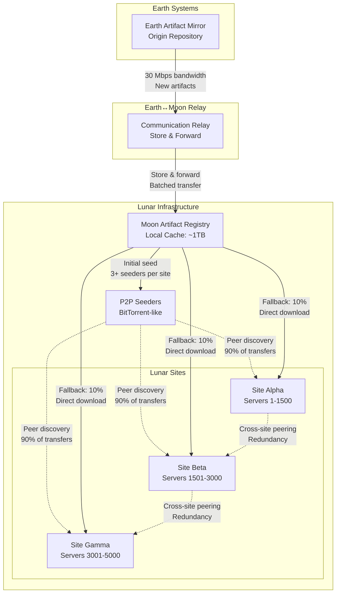

# High-Level Design — Lunar Server Upgrade System

## Purpose
Phase 3: High-level architecture, back-of-the-envelope calculations, APIs, data model, and component diagrams for upgrading 5,000 lunar servers within the constraints defined in the Phase 1 requirements.

---

## Assumptions (clarified)
- Scope: 5,000 servers targeted for the upgrade campaign (Phase 1 uses mixed wording; we assume the 5,000 figure in the title and success criteria is the campaign target).
- Average per-server artifact payload (delta): 100 MB (typical OS/app patch). Use-case note: will vary by patch; design supports larger payloads with P2P and delta transfers.
- Average upgrade duration per server (happy path): 20 minutes (0.333 hours).
- P2P distribution efficiency: 90% of servers fetch from peers; only 10% of total bytes come from Earth-origin mirrors.
- Available upgrade bandwidth from Earth: 30 Mbps (shared); 20 Mbps reserved for other operations.

If you want different artifact sizes or targets, tell me and I’ll re-run the calculations.

---

## Contract (2–3 bullets)
- Inputs: Upgrade campaign definition (artifact, rollout policy, target groups, approvals), per-server health and telemetry.
- Outputs: Per-server upgrade state machine (queued → in-progress → validated → complete or rolled-back), audit logs, metrics and alerts.
- Error modes: network faults, server-level failures requiring rollback, P2P propagation stalls, approval gating delays.

---

## Back-of-the-Envelope Calculations

Campaign: N = 5,000 servers, T = 168 hours (7 days), D = 20 minutes = 0.333 h per server.

Total upgrade-hours required = N * D = 5,000 * 0.333 = 1,666.7 upgrade-hours.

Required average concurrency C = total upgrade-hours / T = 1,666.7 / 168 ≈ 9.92 → ~10 concurrent upgrade slots.

Interpretation: With ~10 parallel upgrades running continuously (average 20m each) the campaign finishes in 7 days. We keep headroom for retries, approval pauses, and tier controls — plan for 30–50 concurrent upgrade slots to meet operational constraints, not to exceed downtime caps.

Concurrency sizing by safety and SLAs:
- Minimum theoretical concurrency to meet timeline: ~10.
- Operational concurrency target (recommended): 30 concurrent upgrades. Rationale: allows staggered batches, retries, and per-tier rate limits while keeping finish time comfortably under 7 days.

Bandwidth and Earth-origin transfer:
- Artifact size S = 100 MB.
- Total raw bytes (no P2P) = N * S = 5,000 * 100 MB = 500,000 MB ≈ 488.28 GB.
- With 90% P2P: Earth-origin bytes = 10% * 488.28 GB ≈ 48.83 GB total fetched from Earth — well within 500 GB cap.

Peak bandwidth for a batch:
- If 30 concurrent upgrades each fetch 100 MB simultaneously, instantaneous demand = 30 * 100 MB / 20 min ≈ 30 * (100 MB / 1200 s) ≈ 2.5 MB/s ≈ 20 Mbps. (Fits the 30 Mbps upgrade allocation when peers and local caching are used.)

Storage and artifact registry sizing (Moon-local mirror):
- Keep N most recent artifacts on Moon mirror: 500 GB is sufficient for a campaign with 100 MB artifacts.
- Add 2× buffer for delta storage and staging: ~1 TB recommended.

Control plane QPS estimate (monitoring + control):
- Heartbeats and state updates: assume 1 update/min per server during upgrade windows => 5,000/60 ≈ 83 updates/s.
- With dashboards, alerting, and retries, provision for 200–500 QPS on the orchestration API.

---

## High-Level Component Diagram

Notes:
- The On-moon P2P Seeder + CDN manages artifact seeding, local mirroring, and peer discovery to keep Earth bandwidth low.
- Air-gapped Tier 1 clusters talk to a local orchestrator instance for approvals; mission control mirrors approval records via Relay when network allows.

---

## High-Level Data Flow

### Campaign Initiation Flow

### Server Upgrade Flow (Per Server)

### Monitoring & Telemetry Flow

### Artifact Distribution Flow

---

## APIs (control plane)

Example endpoints (REST-style) for orchestrator control:
- POST /api/v1/campaigns — create new upgrade campaign (payload: artifact id, target selector, rollout policy, approval required)
- GET /api/v1/campaigns/{id} — campaign state and progress
- POST /api/v1/campaigns/{id}/start — start campaign (requires approvals for Tier 1)
- POST /api/v1/campaigns/{id}/pause — pause campaign
- POST /api/v1/campaigns/{id}/resume — resume campaign
- POST /api/v1/campaigns/{id}/cancel — cancel and optionally rollback
- GET /api/v1/servers/{id}/state — server upgrade state machine and logs
- POST /api/v1/approvals/{campaignId} — submit approval (signed)

Authorization: mutual TLS for Lunar control plane, signed approval tokens for Tier 1.

Event queue and webhooks: orchestrator emits events to a message bus (Kafka/NSQ/Redis streams) and webhook subscribers (monitoring, audit, telemetry).

---

## Data Model (core entities)

- Campaign {
  id, artifact_id, selector (location/cluster/tier), batch_size, concurrency_limit, pause_on_anomaly, approval_required, state, created_at, started_at, completed_at
}

- Artifact {
  id, version, size_bytes, checksum, origin (Earth mirror), staged_at (moon registry), created_at
}

- Server {
  id, hostname, site, cluster, tier, k8s_node?, ip, last_seen, upgrade_state, last_upgrade_attempts[], rollback_count
}

- ApprovalRecord {
  id, campaign_id, approver_id, approver_role, signature, timestamp, decision
}

- AuditLog { timestamp, actor, action, details }

Indexing & partitioning suggestions:
- Partition Topology & Inventory DB by site (geo) and cluster to limit blast radius and optimize queries for batch selection.
- Shard Time-series telemetry by server ID prefix and time-range (VictoriaMetrics already in place).

---

## Deployment & Operational Patterns

- Staging: use 500 test servers as a preflight pool (already in Phase 1). Require green on staging before any Tier 1 rolling.
- Rollout strategy:
  - Tier 3: parallel batch auto (up to configured concurrency)
  - Tier 2: scheduled batches during off-peak with automated pause-on-anomaly
  - Tier 1: manual approval/gated batches; N+2 redundancy ensures only 1 redundant instance upgraded at a time
- Distribution: seed artifact to Moon artifact mirror → CDN/P2P mesh → local clusters. Use BitTorrent-like or rkt-like peer seeding with checksums.
- Health checks: pre-upgrade check (disk, power, replication, process health), post-upgrade smoke tests, integration tests if applicable.
- Rollback: maintain previous artifact/OS image locally; rollback path designed for <5 minutes (fast reconfiguration + traffic drain/restore).

---

## Failure Modes & Mitigations (short)
- Network outage during download: use local seeding and resume; fall back to store-and-forward via lunar mirror.
- P2P stampede: rate-limit initial seeding and use connection helpers (ramp-up windows, backoff).
- Corrupted artifact: pre-stage artifact to 3+ seeders and validate checksums before campaign start.
- Approval delay: decouple Tier1 operator from start via token windowing; allow local emergency stop.

---

## Next Steps (Phase 4 handoff)
- ✅ **Phase 4**: [Design Deep Dive](./deep-dive.md) - Detailed examination of critical components
  - P2P Distribution Strategy & Bandwidth Optimization
  - Rollback Orchestration for Stateful Services  
  - Communication Resilience & Earth-Moon Latency Handling
  - Approval Workflow & Emergency Procedures
- [ ] **Phase 5**: Wrap-up and operational playbook

---

## Quick References
- See Phase 1 requirements: `system-design/questions/upgrades thousands of Machines on  the Moon/requirements.md`
- Related concepts in `system-design/concepts/` (caching, partitioning, reliability, etc.)

